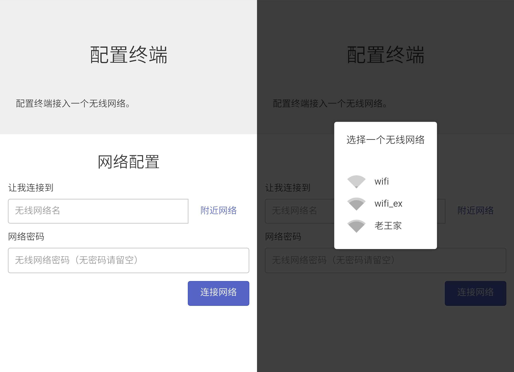

# NodeMCU之旅（四）：实现Web配置页面

## 引言

利用Web页面做配置可以轻松适应用户的多种设备，如Android, IOS等。本文将介绍如何在NodeMCU中实现配置页面。

## 配置页面后端

### HTTP服务

NodeMCU的可用运存大约只有32KB，非常小。

这里推荐一个轻量的HTTP服务库[NodeMCU-HTTP-Server](https://github.com/wangzexi/NodeMCU-HTTP-Server)。下载**httpServer.lua**即可。

### 服务静态文件

在**init.lua**的尾部添加：

```lua
dofile('httpServer.lua')
```

并在`switchCfg()`中启动和关闭监听：

```lua
function switchCfg()
	if wifi.getmode() == wifi.STATION then
		-- ...
		httpServer:listen(80)
	else
		-- ...
		httpServer:close()
	end
end
```

### 测试HTTP服务

可以通过以下方法来测试服务器是否正常。

保存以下代码为**index.html**：

```html
<!DOCTYPE html>
<head>
	<meta charset="UTF-8">
	<meta name="viewport" content="width=device-width, initial-scale=1">
	<title>配置终端</title>
</head>
<body>
	<p>这是我的配置页面。</p>
</body>
</html>
```

上传**init.lua**、**httpServer.lua**以及**index.html**到NodeMCU。

按下**RST**按钮，按下**配置**按钮，用手机连入热点**mymcu**，在浏览器打开 **http://192.168.4.1/** 。

如果一切正常，你将能够看到这个页面。

### GZIP压缩

为了节省空间，此HTTP服务库还支持GZIP。比如：**index.html**可以压缩为**index.html.gz**再上传。

更多细节，请参阅[NodeMCU-HTTP-Server](https://github.com/wangzexi/NodeMCU-HTTP-Server#serving-static-files)。

### 设置IP地址

NodeMCU在自身开放的AP局域网中的默认IP地址是**192.168.4.1**，如果需要修改NodeMCU在本地局域网中的IP地址，请在开启AP后，使用此函数设置：

>设置IP
>[wifi.ap.setip()](http://nodemcu.readthedocs.io/en/master/en/modules/wifi/#wifiapsetip)

注意，该函数只有在开启AP后才有效。

### 后端接口

#### 扫描附近热点

给httpServer添加中间件，当访问**'/scanap'**时：使用`wifi.sta.getap()`获取AP列表再转换到JSON格式返回。

```lua
httpServer:use('/scanap', function(req, res)
	wifi.sta.getap(function(table)
		local aptable = {}
		for ssid,v in pairs(table) do
			local authmode, rssi, bssid, channel = string.match(v, "([^,]+),([^,]+),([^,]+),([^,]+)")
			aptable[ssid] = {
				authmode = authmode,
				rssi = rssi,
				bssid = bssid,
				channel = channel
			}
		end
		res:type('application/json')
		res:send(cjson.encode(aptable))
	end)
end)
```

#### 配置WIFI信息

同样添加一个中间件，当带参数访问**'/config'**时，配置WIFI信息，并返回连接结果。

```lua
TMR_WIFI = 4

httpServer:use('/config', function(req, res)
	if req.query.ssid ~= nil and req.query.pwd ~= nil then
		wifi.sta.config(req.query.ssid, req.query.pwd)

		status = 'STA_CONNECTING'
		tmr.alarm(TMR_WIFI, 1000, tmr.ALARM_AUTO, function()
			if status ~= 'STA_CONNECTING' then
				res:type('application/json')
				res:send('{"status":"' .. status .. '"}')
				tmr.stop(TMR_WIFI)
			end
		end)
	end
end)
```


## 配置页面前端

前端方面的选择就比较多了，我使用了轻量的[Zepto.js](https://github.com/madrobby/zepto)与[Spectre.css](https://github.com/picturepan2/spectre)来搭建前端页面，通过AJAX来请求数据。



相比起后端，前端代码大都是一些界面交互的逻辑，就不贴在这里了。


## 相关资源

你可以在[NodeMCU-Tutorial](https://github.com/wangzexi/NodeMCU-Tutorial)下载到本文的相关资源和代码。